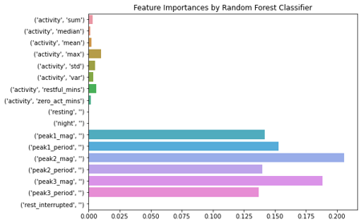

## Project Overview

For this project, we will train multiplier classifiers to predict, from wrist actigraphy data, whether a participant is healthy or has a Major Depressive Disorder (MDD).

## The Data

This project uses the [Depresjon Dataset](https://datasets.simula.no/depresjon/). It contains data collected from a wrist actigraph worn either by inpatients with MDDs or healthy volunteers. The watch was worn by the participant for anywhere between 13 and 45 days, counting the number of movements greater than .05g every minute and recording the sum of those movements per minute. The dataset contains other files related to the diagnoses of the patient, but only the actigraphy data was used to train the following classifiers.

## Business Problem

From the National Institute of Mental Health (NIMH 2019), over 20% of US Adults have mental illnesses meeting clinical diagnostic criteria. Of that 20%, more than half did not receive care from Mental Health Services. As wearable sensors rise in popularity, more and more data is collected that can be used to provide health recommendations to users. This classification algorithm is a proof of concept: Additional health recommendations and alerts that broadly benefit the health of society through quantitative validation and early detection of illness can be achieved with common, everyday technology.

## Data Preparation

To prepare the data for the classifiers to learn from, data was binned by half hour intervals and only full half hour intervals were kept. Statistical features were extracted from a distribution of the activity during each interval. Six features were constructed by implementing a Discrete Fourier Transform and grabbing the three tallest peaks and their magnitudes. These features were selected because activity and circadian rhythms are altered in individuals with MDDs, so metrics describing their activity over half hour intervals plus the use of frequency analysis to detect rhythmic behavior were hypothesized as beneficial for the algorithm's performance.

## Results

In the end, two common classifiers, Sci-kit Learn's Random Forest Classifier and XGBoost's Gradient Boosted Tree, were both 100% effective in correctly classifying individuals as belonging to the healthy or afflicted class. Below are two plots showing the relative feature importances based on information gain for both classifiers:

## Conclusions

Based on our results, we can assert that the most important factors in ability to classify are the presence and strength of circadian rhythms, as the frequency related features were incredibly powerful in discerning between the two groups. 